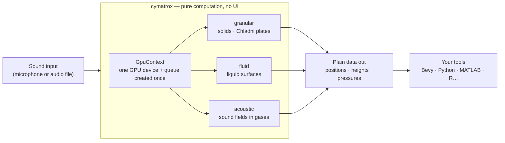

# Cymatrox

> GPU-accelerated scientific toolkit for cymatics simulation — solid, liquid, and gas — written in Rust.

> **Status:** `v0.1.0` published on [crates.io](https://crates.io/crates/cymatrox) — granular, fluid and acoustic modules are implemented and GPU-validated. Deferred features live in the contract open points (v1.1+).

## What is cymatics?

**Cymatics** is the study of *visible* sound — the study of what happens when matter vibrates at specific frequencies:

- sprinkle sand on a metal plate, vibrate it, and the sand snaps into geometric figures;
- shake a dish of liquid vertically at the right rhythm and regular ripples appear on its surface;
- aim sound waves carefully enough and small droplets can float in mid-air.

Each phenomenon is a window into physics, and each takes serious number-crunching to simulate on a computer. That is exactly what Cymatrox computes — on your GPU.

New around here? Every technical term is defined in plain language in the [glossary](./docs/GLOSSARY.md).

## Why Cymatrox

Cymatics is a well-established field, but no Rust crate exists to run cymatics experiments or build simulators from a computer. Cymatrox fills that gap as a **headless, physics-first library**: it computes, you visualize (in whatever engine or tool you prefer).

## The big picture



## Features

Cymatrox will ship three independent physics modules, all running on the GPU via [wgpu](https://github.com/gfx-rs/wgpu):

| Module | Domain | Simply put | Physics | Output |
|---|---|---|---|---|
| **Granular** | Solid (Chladni plates) | Sand settling into geometric patterns on a vibrating plate | Sophie Germain plate equation + Newtonian particle kinetics | `Vec<GranularData>` (position + velocity per grain) |
| **Fluid** | Liquid surface (CymaScope) | Regular ripples forming on a liquid shaken at the right frequency | Damped wave equation with Mathieu (Faraday) parametric forcing + Laplace-Young surface tension ([ADR-0011](./docs/adr/0011-fluid-model.md)) | `Vec<FluidSurfaceNode>` (height + vertical velocity per mesh point) |
| **Acoustic** | Gas (acoustic levitation) | Standing sound waves strong enough to hold small objects in mid-air | Helmholtz equation + Gor'kov force potential | `Vec<AcousticPressureNode>` (pressure in Pa + force vector) |

- Pure computation, no UI — export results as CSV, JSON, or binary for use in MATLAB, Python/NumPy, R, or a rendering engine like Bevy.
- Shared `GpuContext` across modules — no redundant device/queue setup.
- Optional audio-driven input (microphone or file) via `cpal` + FFT.
- Correctness you can trust: every GPU result is validated against a slower, double-precision CPU reference ([ADR-0004](./docs/adr/0004-numerical-precision-strategy.md)).

## Installation

```sh
cargo add cymatrox
```

Requires a GPU-capable host (Vulkan, Metal, or DX12); there is no CPU fallback by design ([ADR-0008](./docs/adr/0008-gpu-only-no-cpu-fallback.md)).

## Usage

Only `GpuContext::new()` is async (adapter request) — every `step()` is a deliberate blocking call that returns the post-step state ([ADR-0006](./docs/adr/0006-gpu-cpu-readback-strategy.md)):

```rust
use cymatrox::{GpuContext, granular::{
    Driving, GrainBed, GranularConfig, GranularSimulation,
    InitialDistribution, ModeSelection, PlateSpec, SolverParams,
}};

#[tokio::main]
async fn main() -> Result<(), cymatrox::Error> {
    let ctx = GpuContext::new().await?;

    let config = GranularConfig {
        experiment: Driving {
            frequency_hz: 440.0,
            amplitude: 1e-4,
            modes: ModeSelection::Auto,
        },
        medium: PlateSpec::Idealized { side: 0.5 },
        grains: GrainBed {
            count: 100_000,
            distribution: InitialDistribution::Uniform,
            seed: 42,
        },
        solver: SolverParams {
            dt: 1.0 / 480.0,
            drag: 4.0,
            restitution: 0.6,
            coupling_k: 5.0e5,
            base_frequency_hz: 120.0,
        },
    };

    let mut sim = GranularSimulation::new(&ctx, config)?;

    sim.set_frequency(432.0);
    let frame = sim.step()?;

    // export, plot, or feed into your own renderer
    println!("{} grains simulated", frame.len());
    Ok(())
}
```

Runnable end-to-end examples live in [`examples/`](./examples/) — one per module:

```sh
cargo run --example granular_chladni   # solids on Chladni plates
cargo run --example fluid_ripples      # Faraday waves on a liquid surface
cargo run --example acoustic_trap      # Gor'kov forces on a droplet
```

## Documentation

| Document | What's inside |
|---|---|
| [`docs/ARCHITECTURE.md`](./docs/ARCHITECTURE.md) | How the crate fits together, with diagrams |
| [`docs/GLOSSARY.md`](./docs/GLOSSARY.md) | Every physics and GPU term in plain language |
| [`docs/CONTRACT.md`](./docs/CONTRACT.md) | The promises each module makes: preconditions, tolerances, failure modes |
| [`docs/adr/`](./docs/adr/) | Design decisions (ADRs) — what was decided and why |

## Performance targets

| Module | Target scale | Frame rate |
|---|---|---|
| Granular | 100k – 1M particles | ≥ 60 FPS |
| Fluid | 512×512 – 2048×2048 grid | ≥ 60 FPS |
| Acoustic | 64³ – 256³ volume | ≥ 60 FPS |

## Roadmap

- [x] Design — architecture docs, ADRs, contract & invariants
- [x] Phase 0 — Foundations (`GpuContext`, error types, build pipeline)
- [x] Phase 1 — Granular module
- [x] Phase 2 — Fluid module
- [x] Phase 3 — Acoustic module
- [x] Phase 4 — Integration, polish, `v0.1.0` release

## Contributing

Contributions are welcome — see [`CONTRIBUTING.md`](./CONTRIBUTING.md) for setup and conventions.

## License

Dual-licensed under [`MIT`](./LICENSE-MIT) or [`Apache-2.0`](./LICENSE-APACHE), at your option — the same convention as the Rust ecosystem itself (and `wgpu`). Correspondingly `SPDX-License-Identifier: MIT OR Apache-2.0`.
