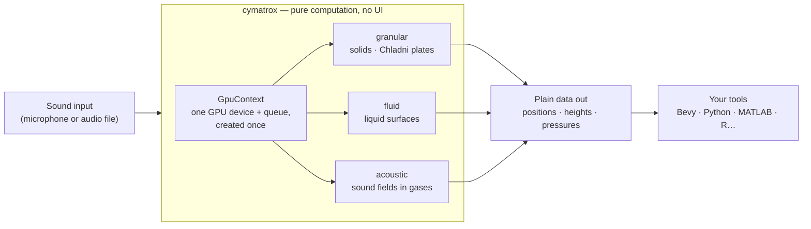
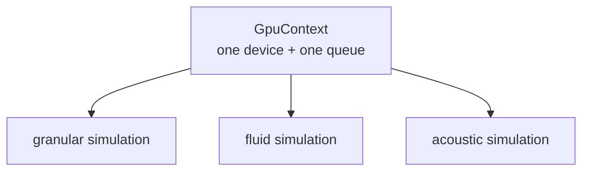
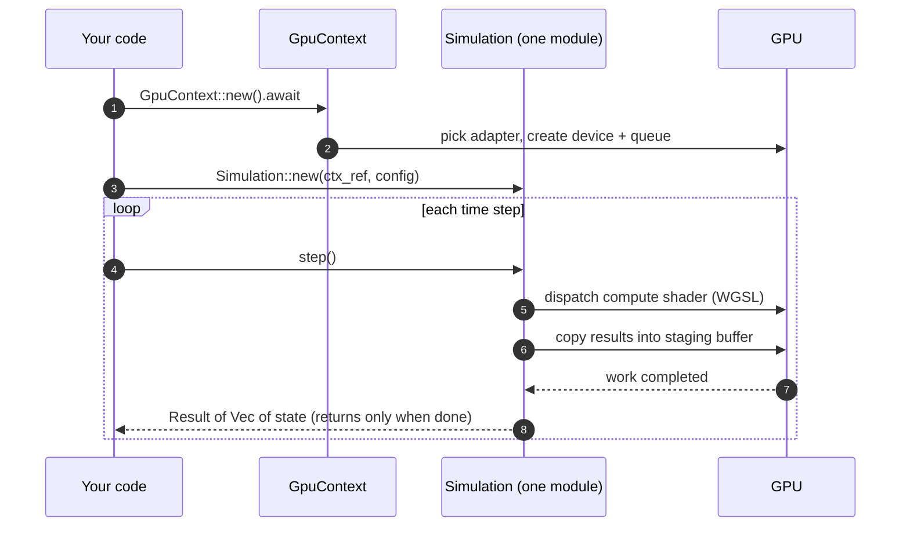
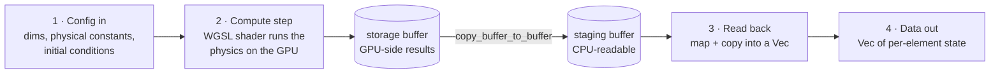
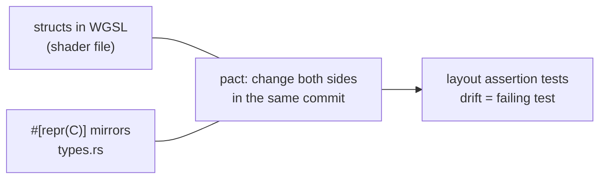

# Architecture

> **Reading tip** — unfamiliar words? Every term is defined in plain language in the [glossary](./GLOSSARY.md). This page explains *how* Cymatrox is built; the [ADRs](./adr/) explain *why*.

## Overview

Cymatrox is a single crate exposing three independent physics modules that share one GPU context. It has no rendering or UI layer — its only job is to compute physical state and hand it back as plain data.

Think of it as a **calculator, not a display**: you describe an experiment, Cymatrox runs it on the GPU, and you get numbers back that you can plot or render however you like.

```
cymatrox
├── core/        GpuContext, shared error type, buffer/bindgen utilities
├── granular/    Module 1 — solid (Chladni plates)
├── fluid/       Module 2 — liquid surface (CymaScope)
├── acoustic/    Module 3 — gas (acoustic levitation)
└── io/          Audio input (cpal + FFT), CSV/JSON/binary export
```

## The big picture



## Shared GPU context

A single `GpuContext` (device + queue) is created once and passed by reference into every module. Modules never create their own `wgpu::Device` — this avoids redundant GPU initialization and lets several simulations run side by side against the same hardware. See [ADR-0002](./adr/0002-shared-gpu-context.md).



## How a simulation runs

One constructor call to get the GPU, then a plain `step()` per frame — synchronous on purpose, so using Cymatrox feels like calling MATLAB or NumPy ([ADR-0006](./adr/0006-gpu-cpu-readback-strategy.md)).



## Module data flow

Every module follows the same four-step pipeline — only the physics equation changes:



| Module | Equation | Per-step output |
|---|---|---|
| Granular | Sophie Germain plate equation + Newtonian kinetics (friction, rebound) | `Vec<GranularData>` |
| Fluid | Damped wave equation, Mathieu (Faraday) parametric forcing + Laplace-Young surface tension ([ADR-0011](./adr/0011-fluid-model.md)) | `Vec<FluidSurfaceNode>` |
| Acoustic | Helmholtz equation + Gor'kov force potential | `Vec<AcousticPressureNode>` |

The storage-buffer → staging-buffer detour is a platform constraint: GPUs generally forbid direct CPU reads of storage buffers ([ADR-0006](./adr/0006-gpu-cpu-readback-strategy.md)). All three modules share this exact pattern.

## WGSL ↔ Rust type mirroring

Shared struct layouts are written **once on each side** — in WGSL next to the shader, and as `#[repr(C)]`/`bytemuck::Pod` mirrors in `src/<module>/types.rs`. The sync guarantee originally planned via `wgsl_bindgen` codegen is instead enforced by **assertion tests** that pin sizes and field offsets ([ADR-0010](./adr/0010-manual-type-mirroring.md)). Same goal — the GPU side and the CPU side can never silently disagree about memory layout — with one less moving build dependency.



## Why a single crate

Cymatrox ships as one crate rather than one per module (no `cymatrox-granular`, `cymatrox-fluid`, …). The reasoning and trade-offs are recorded in [ADR-0001](./adr/0001-single-crate-architecture.md); short version: simpler releases for a solo maintainer, and most users want more than one module anyway.

## Contracts and invariants

Per-module preconditions, postconditions, invariants, failure modes, and golden-file tolerances are documented in [`CONTRACT.md`](./CONTRACT.md) — written *before* implementation, not reverse-engineered from code afterwards. The shared [`GpuContext`](./CONTRACT.md#gpucontext-shared) contract is already complete.
